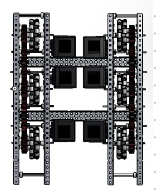
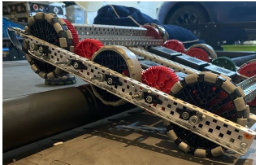
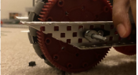
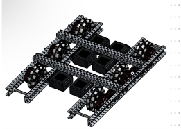

<h1 align="center">VEX V5 Competition Robot</h1>

<p align="center">
  Team 19697Z Pyronauts<br>
  <sub>Six-motor tank drive · three-wheel odometry · heading-corrected PID · pneumatics</sub>
</p>

<p align="center">
  
  
  
  
</p>

<p align="center">
  
  
</p>

<p align="center">
  
</p>

---

## Results

Team **19697Z Pyronauts** — **4× VEX Robotics World Championship qualifier**.

| Award | Event | |
|---|---|---|
| 🏆 **Excellence Award** | Region 3 State Championships | Feb 2025 |
| 🏆 **UIL Texas State 6A Champions** | University Interscholastic League | Feb 2025 |
| 🥈 **2nd Place Skills Champions** | Region 3 State Championships | Feb 2025 |
| 🏆 **Build Award** | Region 3 State Championships | Feb 2024 |

Across 2021–2025: **6× Excellence Award winner, 12× Tournament Champion/Finalist, 25× award
winner.** The Excellence Award is the program's top honour and weighs autonomous performance and
engineering documentation alongside match play — which is most of why this codebase is organised
the way it is.

## Features

- **Three-wheel odometry** — absolute field position from two parallel tracking wheels plus a
  perpendicular rear wheel, so sideways displacement is tracked, not guessed
- **Heading-corrected straight driving** — a proportional inertial term split differentially
  across the drivetrain, so a straight command corrects its own drift mid-move
- **PID motion primitives** — distance, turn and lift loops with clamped integral and timeouts
- **Open-loop primitives** — direct `spinFor` equivalents kept for quick tuning
- **Brain-screen auton selector** — tap to cycle routines, no re-download between matches
- **Tank driver control** — stick deadband, edge-triggered pneumatics, live pose readout
- **Host type-check** — `tools/syntax-check.sh` compiles every file against stubbed SDK headers

## Why the code is shaped like this

Matches are fifteen seconds of autonomous on a field that is, mechanically, quite slippery. A
couple of degrees of heading error at the start of a move compounds into a missed scoring element
by the end of it. Almost everything in this repo exists to keep the robot where it thinks it is:

- Turns close on the **inertial sensor**, not on wheel encoders, because slip during a pivot is
  invisible to an encoder — the wheel turns and the robot doesn't.
- Straight moves carry a **heading cross-term**: `left = power + Kc·err`, `right = power − Kc·err`
  with `Kc = 0.5`. Applied differentially, it steers without changing forward speed, so the robot
  fights drift as it happens instead of arriving crooked.
- The **rear tracking wheel** is what makes the odometry more than dead reckoning. When a
  defensive robot shoves you sideways, a two-encoder model reports that nothing happened.

## Hardware

| Subsystem | Configuration |
|---|---|
| Drivetrain | 6× V5 motors, `ratio6_1` (600 rpm) — 3 per side |
| Lift | 1× V5 motor, `ratio18_1` (200 rpm) for torque |
| Pneumatics | Both wing pistons on one solenoid via a tee (3-wire H) |
| Tracking | 3× quadrature encoders — left, right, rear (pairs A+B, C+D, E+F) |
| Heading | V5 inertial sensor (PORT6) |
| Wheels | 3.0 in diameter, 360 ticks/rev |

Ports live in [`src/robot-config.cpp`](src/robot-config.cpp) and nowhere else.

<p align="center">
  
  
  
</p>

## Tuning

| Loop | kP | kI | kD |
|---|---|---|---|
| Distance (wheel turns) | 0.6 | 0.04 | 0.3 |
| Turn (degrees) | 0.3 | 0.02 | 0.005 |
| Lift (turns) | 0.6 | 0.04 | 0.3 |

Heading cross-gain `Kc = 0.5`. Loops tick every 20 ms, clamp the integral to ±50, and time out
after 4 s so a stalled mechanism ends the move rather than the match.

Odometry geometry — track width and rear-wheel offset — is at the top of
[`src/odometry.cpp`](src/odometry.cpp). **Measure these on your own robot;** the pose is only as
good as they are.

## Layout

```
src/
├── main.cpp          competition entry, driver control
├── robot-config.cpp  every device and port
├── drive.cpp         PID motion primitives
├── odometry.cpp      three-wheel position tracking
└── autons.cpp        routines + brain-screen selector
include/              matching headers
tools/
├── syntax-check.sh   host type-check
└── stubs/            minimal V5 SDK stand-ins
media/                CAD renders and build photos
```

## Building

Open the folder in **VEXcode V5 Pro** (or VS Code with the VEX extension), match the ports in
`src/robot-config.cpp` to your build, then download to the brain.

The robot must sit **still** at startup — `vexcodeInit()` blocks while the inertial sensor
calibrates, and every heading correction afterwards is relative to that reading.

### Type-checking without the SDK

```bash
bash tools/syntax-check.sh
```

Compiles all five translation units on a host `g++` against the stubs in `tools/stubs/`. It
catches redefinitions, missing declarations and type errors; it does **not** check runtime
behaviour. The real SDK headers ship with VEXcode and can't be redistributed, which is why the
stubs exist.

## Autonomous routines

Defined in [`src/autons.cpp`](src/autons.cpp), selected by tapping the brain screen:

| Routine | Description |
|---|---|
| `NEAR_SIDE` | Deploy, score the preload, retreat to a legal position |
| `FAR_SIDE` | Cross, deploy wings, score, reposition |
| `SKILLS` | 60 s run — three scoring cycles, then lift |

Distances are in wheel turns and headings in degrees, and both get re-tuned per field. That's
the whole reason they live in one file instead of scattered through `main.cpp`.

## History

Restructured in August 2026. The original was a single 613-line `main.cpp` alongside a
`robot-config` pair, and it did not compile: `moveForward(double)` was defined twice in the same
translation unit, `lift` and `wings` were defined in both files and disagreed about which
three-wire port the solenoid was on, `updateOdometry()` was called seventeen times before it was
declared, `wheelBaseWidth` and `backWheelOffset` were used but never declared, `wings.left_wing.set()`
addressed a member that doesn't exist on `digital_out`, several `wait(1, sec)` calls were missing
semicolons, and `robot-config.h` both dropped a semicolon and never declared the inertial sensor.

The odometry also wrapped its heading delta as though it were degrees while computing it in
radians — a branch that could never fire, and would have corrupted the pose if it had.

Control gains and the odometry approach are carried over unchanged. The structure around them
is new. The original is in the git history.

## License

MIT — see [LICENSE](LICENSE).
